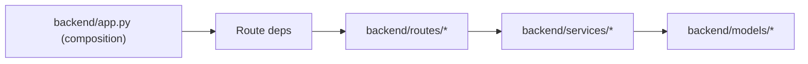
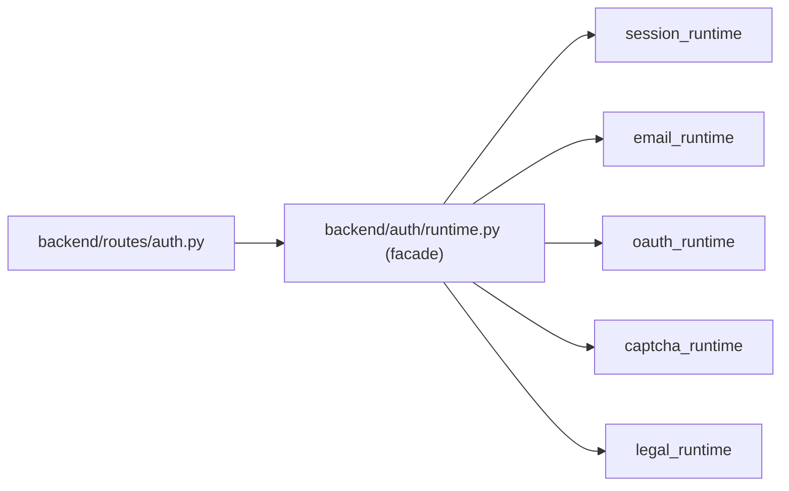

# Backend API Architecture

## Overview
- `backend/app.py` is the application composition layer.
- `backend/routes/*` own HTTP resource wiring and response shaping.
- `backend/services/*` own query orchestration and side-effect orchestration.
- `backend/models/*` own ORM/reflection surfaces.
- `backend/schemas/*` own request/response validation and serialization.
- `backend/core/*` owns shared runtime plumbing:
  - `config.py` for app/bootstrap config composition
  - `errors.py` for API error response wiring
  - `hooks.py` for request hook wiring and header policy
- `backend/auth/runtime.py` is a compatibility facade only.
- Auth runtime logic is split by domain:
  - `backend/auth/session_runtime.py` for session transport, cookies, auth DB/mock store, session tokens, request identity helpers
  - `backend/auth/email_runtime.py` for email normalization and Resend delivery helpers
  - `backend/auth/oauth_runtime.py` for provider token exchange / JSON fetch helpers
  - `backend/auth/captcha_runtime.py` for Turnstile verification helpers
  - `backend/auth/legal_runtime.py` for legal acceptance validation/persistence and sign-on event logging

## Runtime Flow

## Auth Flow

## Route Dependency Injection
- Route registration is explicit and typed through `backend/routes/deps.py`.
- `backend.app._build_route_deps()` constructs:
  - `SectionsDeps`
  - `AgreementsDeps`
  - `ReferenceDataDeps`
  - `AuthDeps`
- Routes consume these dependency objects rather than dynamic module lookups.
- `AccessContextProtocol` is the shared typed access-context contract for runtime route/service calls.
- Keep dependency typing strict for helper call signatures; keep reflected SQLAlchemy model handles pragmatic where strict typing would add fragile casts.

## Runtime Contracts
- Public API behavior is unchanged:
  - no endpoint additions/removals
  - no response/request schema changes
  - no auth/session/CORS behavior changes
- Internal contracts are explicit:
  - `register_sections_routes(*, deps: SectionsDeps) -> Blueprint`
  - `register_agreements_routes(app: Flask, *, deps: AgreementsDeps) -> tuple[Blueprint, Blueprint]`
  - `register_reference_data_routes(*, deps: ReferenceDataDeps) -> tuple[Blueprint, Blueprint, Blueprint]`
  - `register_auth_routes(app: Flask, *, deps: AuthDeps) -> Blueprint`

## Testing Guardrails
- `backend/tests/test_route_contracts.py` checks route and operationId stability.
- `backend/tests/test_auth_dependencies.py` checks auth dependency wiring.
- `backend/tests/test_runtime_typing_guards.py` blocks broad file-level pyright suppressions in runtime files.
- `backend/tests/test_runtime_typing_guards.py` also guards:
  - narrow `Callable[..., Any]` usage in `backend/routes/deps.py` (allowed only where SQLAlchemy expression typing is still dynamic)
  - `backend/auth/runtime.py` staying facade-sized with no runtime logic definitions

## Where New Code Should Live
- New endpoint logic: `backend/routes/*` + `backend/services/*`.
- New request/response schema: `backend/schemas/*`.
- New DB model/reflection logic: `backend/models/*`.
- App bootstrap/config-only changes: `backend/app.py`.
